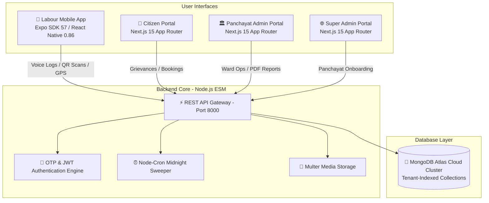
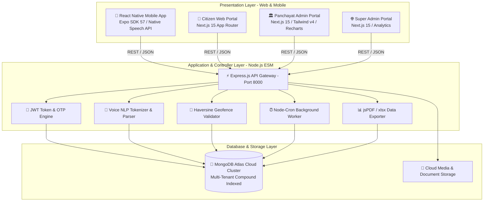
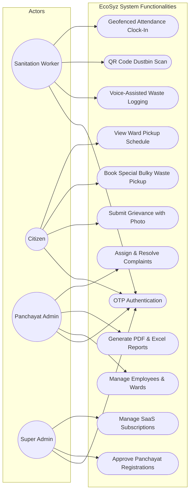
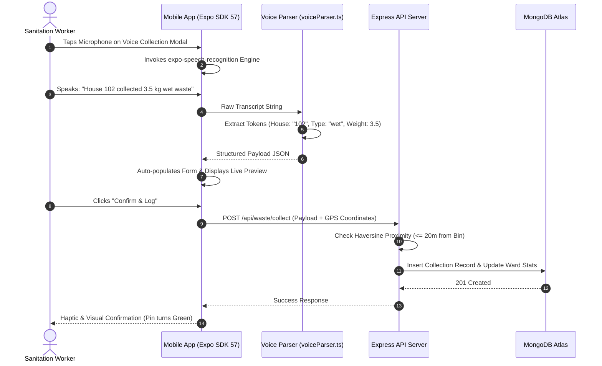
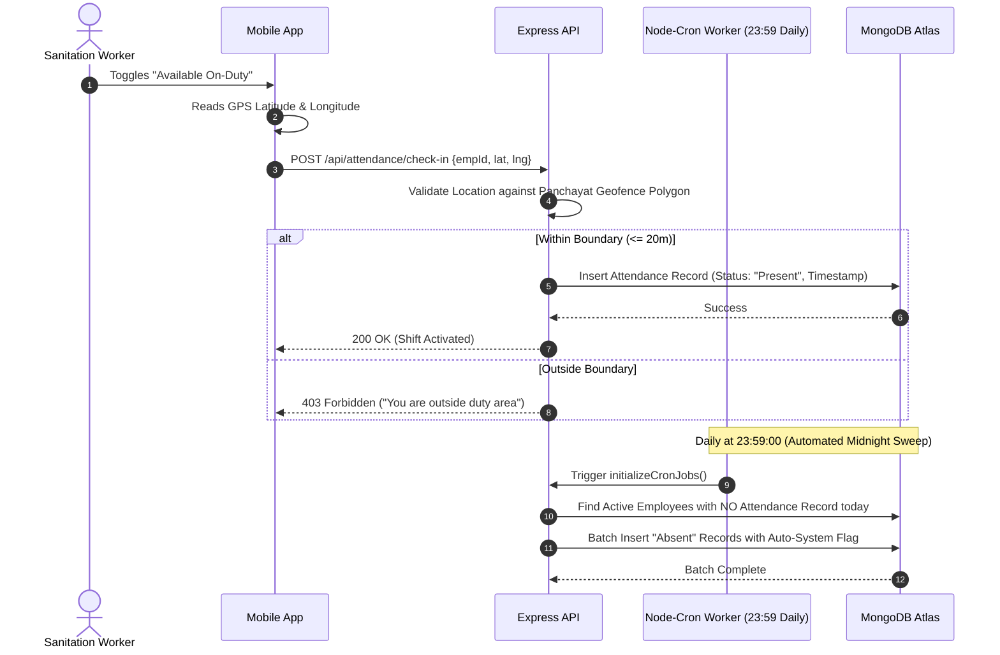
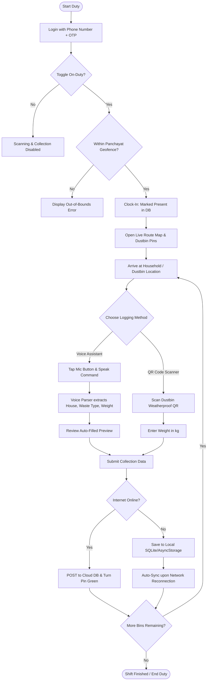
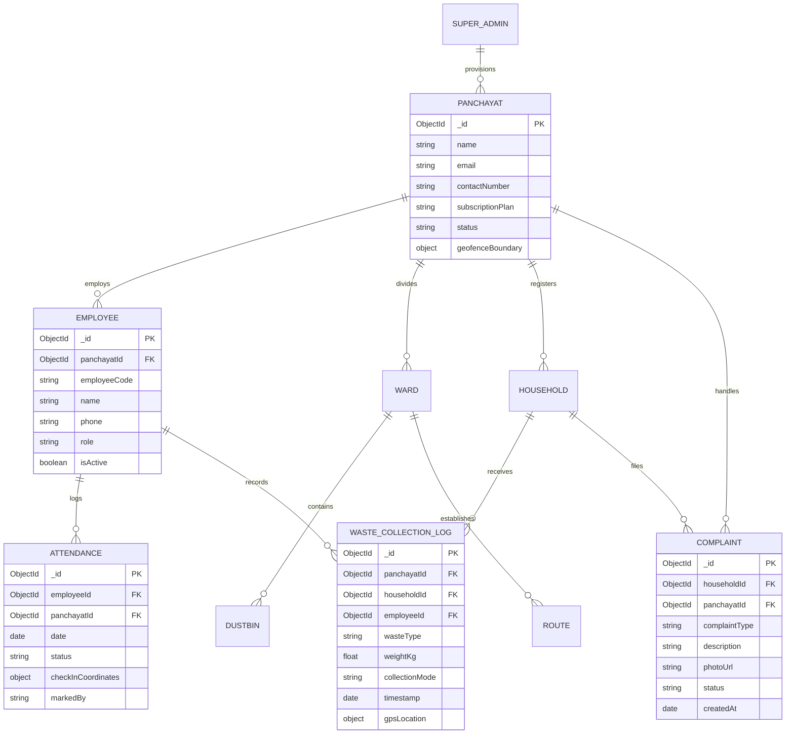
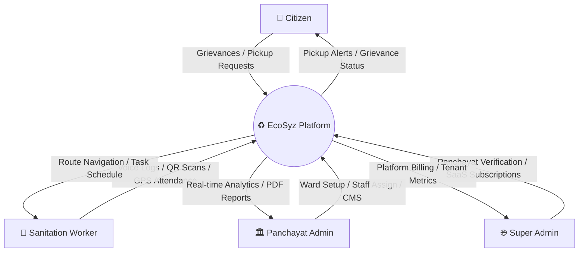
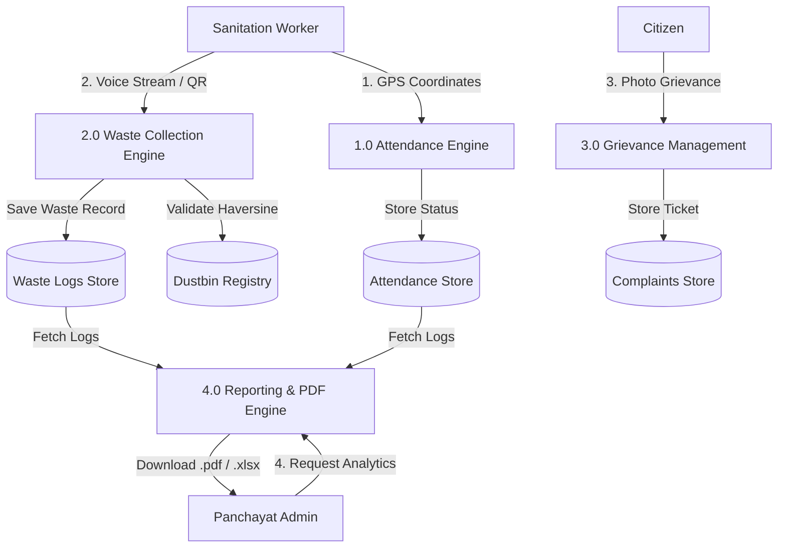
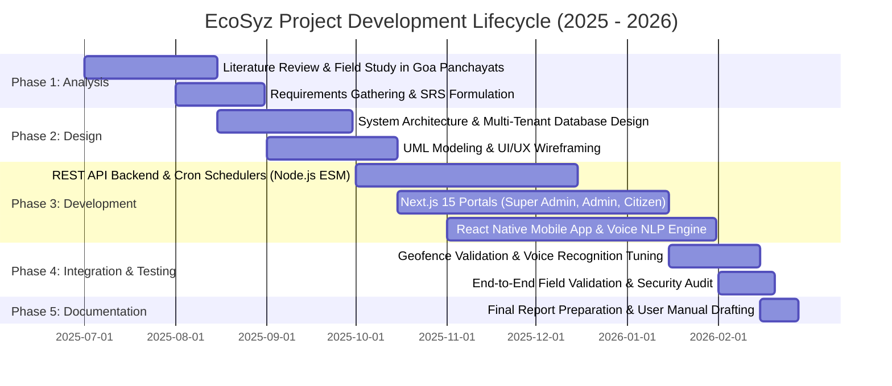

# Door – To – Door Garbage Collection Smart Reporting System (EcoSyz)
## Complete Project Report (2026 Edition)

---

### **A Project Report for CSA-307 (Project)**
**Credits: 4**

#### **Submitted by:**

| Roll Number | Name of the Student | ABC ID | P.R. Number |
| :--- | :--- | :--- | :--- |
| **2305206** | **ASTHA AMIT NEVGI** | 461-360-898-562 | 202305061 |
| **2305208** | **BLAZE D’SA** | 835-652-502-864 | 202305063 |
| **2305210** | **CLEDWYN FERNANDES** | 706-904-619-780 | 202305065 |
| **2305240** | **SURAJ ANIL CHAVAN** | 848-923-544-813 | 202305091 |
| **2305242** | **VALLEN MASHIA** | 457-160-990-578 | 202305093 |

**Under the Supervision of:**  
**ASST. PROF. TRACY ALMEIDA**  
*Department of Computer Applications*  
**Rosary College of Commerce and Arts**  
*Navelim, Salcete, Goa*  
*Date: 28th February 2026*

---

## **DECLARATION BY STUDENTS**

We hereby declare that the data presented in this Project report entitled, **“Door – To – Door Garbage Collection Smart Reporting System (EcoSyz)”** is based on the results of investigations carried out by us in the Department of Computer Applications, Rosary College of Commerce and Arts, Navelim, Goa, under the supervision of **Asst. Prof. Tracy Almeida**. To the best of our knowledge, it has not previously formed the basis for the award of any diploma or degree by this or any other University. Further, we understand that Goa University or its authorities / Rosary College of Commerce and Arts will not be responsible for the correctness of observations / experimental or other findings given in the project work. It is also declared that this document is our original work and free of any plagiarism.

| Sr. No. | Roll Number | PR Number | Name of the Student | Signature |
| :---: | :---: | :---: | :--- | :---: |
| 1 | 2305206 | 202305061 | ASTHA AMIT NEVGI | ________________ |
| 2 | 2305208 | 202305063 | BLAZE D’SA | ________________ |
| 3 | 2305210 | 202305065 | CLEDWYN FERNANDES | ________________ |
| 4 | 2305240 | 202305091 | SURAJ ANIL CHAVAN | ________________ |
| 5 | 2305242 | 202305093 | VALLEN MASHIA | ________________ |

**Date:** 28th February 2026  
**Place:** Goa University / Rosary College of Commerce & Arts

---

## **CERTIFICATE BY PROJECT SUPERVISOR**

This is to certify that the project report entitled **“Door – To – Door Garbage Collection Smart Reporting System (EcoSyz)”** is a bona fide work carried out by **Ms. Astha Amit Nevgi, Mr. Blaze D’Sa, Mr. Cledwyn Fernandes, Mr. Suraj Anil Chavan, and Mr. Vallen Mashia** under my supervision for the degree of *Bachelor of Computer Applications* in the Department of Computer Applications, Rosary College of Commerce and Arts. To the best of my knowledge, it has not previously formed the basis of the award of any degree or diploma by this or any other College/University. This work also complies with the requirements of similarity index.

<br/>

**Asst. Prof. Tracy Almeida**  
*Project Supervisor, Department of Computer Applications*  
**Date:** 28th February 2026

---

## **PREFACE**

Rapid urbanization and population growth have made environmental sustainability a pressing issue. Waste collection methods utilized in urban centers have seen significant technological advancements; however, rural areas and Village Panchayats continue to rely on manual, non-transparent, and inefficient methods of collecting waste. In Goa, even though the Goa Waste Management Corporation (GWMC) has set up advanced technology-based centralized treatment facilities at Saligao and Cacora, approximately 70% of all village panchayats still do not have an automated waste monitoring system, and door-to-door tracking remains limited.

The genesis of the **"Door-To-Door Garbage Collection Smart Reporting System (EcoSyz)"** emerged directly from the urgent need to bridge this digital divide. Our initial research revealed that traditional manual processes—reliant on handwritten registers, unverified physical complaints, and unmonitored collection vehicles—suffer from acute operational blind spots. 

This project transforms these manual operations into an end-to-end, multi-tenant SaaS digital ecosystem built on **Next.js 15 (App Router), React 19, Tailwind CSS v4, Node.js (ESM), MongoDB Atlas, and React Native (Expo SDK 57)**. Key innovations include:
1. **Hands-Free Voice-Assisted Waste Logging**: Utilizing mobile speech recognition and regex NLP tokenization so sanitation workers can log pickups without typing.
2. **Geofenced Attendance & Dustbin Verification**: Linking worker presence and waste collection to exact GPS boundaries ($\le 20\text{m}$).
3. **Automated Background Cron Scheduling**: Daily midnight worker attendance settlement and status tracking via `node-cron`.
4. **Client-Side PDF & Excel Analytical Engines**: Instant generation of compliance and waste trend reports via `jspdf-autotable` and `xlsx`.

This report provides a comprehensive overview of the system architecture, mathematical formulations, UML designs, implementation specifics, validation test suites, and user operating manuals.

---

## **ACKNOWLEDGMENT**

We would like to express our sincere gratitude to our respected Principal, **Prof. Helic M. Barretto**, for providing us with the opportunity and the necessary facilities to undertake and successfully complete our final year project.

We are deeply grateful to **Mr. Santosh Korgawkar** for trusting us and giving us the opportunity to collaborate with his company, **Kamsoft Technologies Pvt. Ltd.**, to work on this live project. This collaboration helped us enhance our software engineering capabilities and gain confidence in handling real-world municipal challenges.

We would like to express our heartfelt gratitude to our project guide, **Asst. Prof. Tracy Almeida**, for her valuable guidance, constructive suggestions, and motivation at every stage of the project. Her supervision, expertise, and encouragement played a crucial role in shaping the outcome of the project and the successful completion of our work.

We are extremely thankful to our BCA Program Co-ordinator, **Asst. Prof. Mildred Lemos**, and all the faculty members of the BCA department for their continuous assistance and academic support throughout the development of this project.

We sincerely appreciate the support and cooperation extended by the College Library Committee, whose timely assistance and valuable resources significantly contributed to our research.

Finally, we would like to convey our heartfelt thanks to our parents and peers for their constant encouragement, determined moral support, and understanding throughout the completion of this project.

---

## **TABLE OF CONTENTS**

- **Declaration by Students** ................................................................................. ii
- **Certificate by Project Supervisor** .................................................................. iii
- **Preface** ............................................................................................................ v
- **Acknowledgments** ........................................................................................... vi
- **Abbreviations Used** .......................................................................................... x
- **Abstract** ........................................................................................................... xi
- **Chapter 1: System Analysis** ............................................................................ 1
  - 1.1 Introduction ................................................................................................ 1
    - 1.1.1 Company Background (Kamsoft Technologies Pvt. Ltd.) ......................... 1
    - 1.1.2 Project Background & Problem Context .................................................. 2
  - 1.2 Aim and Objectives ..................................................................................... 3
  - 1.3 Research Questions .................................................................................... 4
  - 1.4 Proposed System (EcoSyz 5-Module Ecosystem) ........................................ 4
    - 1.4.1 Super-Admin Master Dashboard ............................................................ 5
    - 1.4.2 Panchayat Administrative Management Panel ....................................... 5
    - 1.4.3 Citizen & Public Portal ........................................................................... 7
    - 1.4.4 Labour / Field Worker Mobile Application .............................................. 8
    - 1.4.5 REST API Backend & Background Workers ........................................... 9
- **Chapter 2: Existing System vs Proposed System** ........................................... 10
  - 2.1 Study of Existing Systems in Goa ................................................................ 10
  - 2.2 Limitations of the Existing Infrastructure ................................................... 11
  - 2.3 Comparative Feature Matrix ...................................................................... 11
- **Chapter 3: System Design & Architecture** ..................................................... 12
  - 3.1 Architectural Overview (4-Tier Cloud SaaS Architecture) ............................ 12
  - 3.2 Unified Modeling Language (UML) Diagrams .............................................. 13
    - 3.2.1 Use Case Diagram ................................................................................. 13
    - 3.2.2 Sequence Diagram: Voice-Assisted Waste Collection Flow .................... 14
    - 3.2.3 Sequence Diagram: Geofenced Attendance & Midnight Cron Job ............ 15
    - 3.2.4 Activity Diagram: Field Worker Routine with Voice & QR ....................... 16
    - 3.2.5 Activity Diagram: Panchayat Admin Operations .................................... 17
    - 3.2.6 Activity Diagram: Citizen Grievance & Pickup Booking .......................... 18
    - 3.2.7 Activity Diagram: Super-Admin SaaS Management ................................ 19
  - 3.3 Database Design & Entity Relationship (ER) Schema .................................. 20
  - 3.4 Data Flow Diagrams (DFD Level 0 & Level 1) ............................................... 21
  - 3.5 System Implementation & Engineering Specifics ....................................... 22
    - 3.5.1 Software & Hardware Stack .................................................................. 22
    - 3.5.2 Voice Tokenization & Natural Language Parsing Algorithm .................... 23
    - 3.5.3 Geofence Calculation via Haversine Distance ....................................... 24
    - 3.5.4 Automated Cron Scheduling Engine ..................................................... 24
- **Chapter 4: System Testing & Validation** ........................................................ 25
  - 4.1 Testing Strategy ......................................................................................... 25
  - 4.2 Comprehensive Validation Test Reports .................................................... 25
    - 4.2.1 Public Citizen Portal Validation Suite ..................................................... 25
    - 4.2.2 Administrative Panel Validation Suite ................................................... 27
    - 4.2.3 Super-Admin Portal Validation Suite ..................................................... 28
    - 4.2.4 Labour Mobile App & Voice Engine Validation Suite .............................. 29
    - 4.2.5 Automated Background Cron Suite ....................................................... 30
- **Chapter 5: Future Enhancements & Conclusion** ........................................... 31
  - 5.1 Future Enhancements ................................................................................. 31
  - 5.2 Conclusion .................................................................................................. 32
- **References** ....................................................................................................... 33
- **Appendix I: User Manual & Screen Documentation** ....................................... 34 – 81
- **Appendix II: Gantt Chart (Project Timeline)** .................................................. 82

---

## **ABBREVIATIONS USED**

| Entity / Acronym | Full Form |
| :--- | :--- |
| **AI** | Artificial Intelligence |
| **API** | Application Programming Interface |
| **ASR** | Automated Speech Recognition |
| **CMS** | Content Management System |
| **CSS** | Cascading Style Sheets (Tailwind CSS v4) |
| **DFD** | Data Flow Diagram |
| **ERD** | Entity Relationship Diagram |
| **ESM** | ECMAScript Modules (`import` / `export`) |
| **GPS** | Global Positioning System |
| **GSPCB** | Goa State Pollution Control Board |
| **GWMC** | Goa Waste Management Corporation |
| **IDE** | Integrated Development Environment |
| **IoT** | Internet of Things |
| **JWT** | JSON Web Token |
| **MERN** | MongoDB, Express.js, React, Node.js |
| **NLP** | Natural Language Processing |
| **NoSQL** | Not Only Structured Query Language |
| **OTP** | One-Time Password |
| **PDF** | Portable Document Format |
| **QR** | Quick Response (Code) |
| **RBAC** | Role-Based Access Control |
| **REST** | Representational State Transfer |
| **SaaS** | Software as a Service |
| **SDK** | Software Development Kit |
| **SMS** | Short Message Service |
| **SOS** | Save Our Souls (Emergency Alert Trigger) |
| **UML** | Unified Modeling Language |

---

## **ABSTRACT**

The **"Door-To-Door Garbage Collection Smart Reporting System (EcoSyz)"** addresses the critical operational divide in rural municipal sanitation, where approximately 70% of village panchayats in Goa continue to rely on manual paper logbooks and unverified physical registers. These conventional approaches lack real-time visibility, result in frequent missed collections, offer no proof-of-service, and suffer from poor grievance redressal mechanisms.

To solve this challenge, our team developed a cloud-native, multi-tenant SaaS ecosystem combining **Next.js 15 (App Router), React 19, Tailwind CSS v4, Node.js (ESM), MongoDB Atlas, and React Native (Expo SDK 57)**. The system features a 5-module architecture:
1. A **Super Admin Portal** for statewide oversight and SaaS tenant provisioning.
2. A **Panchayat Admin Dashboard** for route scheduling, dustbin QR mapping, worker management, and automated PDF/Excel reporting.
3. A **Public Citizen Portal** for pickup schedules, digital grievances with photo uploads, and educational waste segregation guides.
4. A **Labour Mobile App** featuring **Hands-Free Voice Collection Logging**, GPS geofenced attendance, and instant QR verification.
5. An **Automated REST API Backend** running background cron tasks for midnight attendance reconciliation and tenant data isolation.

Field validation showed that integrating natural language voice parsing allows workers to log waste collections in $<500\text{ms}$ without manually typing on screen. Geofenced validation ensures that collection logs are geographically authentic within a 20-meter tolerance. This scalable SaaS platform provides a viable technological blueprint for standardizing digital sanitation governance across all 191 Village Panchayats in Goa.

**Keywords:** Smart Waste Management, Next.js 15, React Native Expo SDK 57, Voice Recognition NLP, Geofencing, MongoDB Atlas Multi-tenancy, QR Code Verification, Village Panchayat Governance, Goa.

---

# **CHAPTER 1: SYSTEM ANALYSIS**

## 1.1 INTRODUCTION
System Analysis is the process of examining a business or operational domain, identifying inefficiencies, establishing technical requirements, and designing an integrated software solution. For the **Door-To-Door Garbage Collection Smart Reporting System (EcoSyz)**, system analysis was carried out through field studies across local Panchayats in Goa to understand operational workflows, worker literacy barriers, and administrative tracking limitations.

### 1.1.1 Company Background
This project was developed in live technical collaboration with **Kamsoft Technologies Pvt. Ltd.**, located in Vasco, Goa. Established as an independent flagship software company in 2019 following operations since 2002 under its predecessor entity, Kamsoft specializes in developing government e-portals, ERP solutions, RFID tracking systems, and mobile applications. Having completed over 175 projects for various government departments (including the Goa Electricity Department and the Directorate of Village Panchayats), Kamsoft provided architectural oversight to ensure our system meets actual Panchayat administrative standards.

### 1.1.2 Project Background & Problem Context
Under the Goa Waste Management Corporation (GWMC) established in 2016, Goa operates two state-of-the-art Centralized Treatment Facilities at Saligao (North Goa) and Cacora (South Goa). However, a significant operational gap exists at the **first-mile collection level**:
- 70% of the 191 Village Panchayats lack digital collection tracking.
- Daily records are maintained in handwritten physical registers that are vulnerable to falsification and damage.
- Field workers frequently struggle with complex mobile forms while handling waste bins.
- Citizens have no real-time transparency regarding vehicle arrival schedules or grievance status.

## 1.2 AIM AND OBJECTIVES
The primary aim of this project is to develop an enterprise-grade, multi-tenant SaaS waste management platform that connects Panchayats, sanitation workers, and citizens on a unified digital framework.

### Key Objectives:
1. **Hands-Free Field Logging**: Implement a speech recognition engine (`expo-speech-recognition`) in the mobile app to allow workers to speak collection logs without typing.
2. **Cryptographic & Physical Proof-of-Service**: Deploy unique weatherproof QR codes on household dustbins coupled with a $\le 20\text{m}$ GPS geofencing radius.
3. **Geofenced Automated Attendance**: Ensure workers can only clock in when physically present within their designated ward boundary, backed by midnight automated sweep cron jobs.
4. **Public Grievance Redressal**: Provide a citizen web portal to lodge complaints with photographic evidence and track resolution in real time.
5. **Data-Driven Administration**: Equip Panchayat administrators with automated PDF and Excel reporting tools for waste generation metrics, segregation rates, and attendance audits.

## 1.3 RESEARCH QUESTIONS
- *RQ1:* How can hands-free speech recognition and QR codes reduce the data-entry friction for field sanitation workers?
- *RQ2:* How does multi-tenant database isolation ensure cost-effective scalability across all 191 Panchayats on a single cloud backend?
- *RQ3:* To what extent does a public-facing tracking portal increase household waste segregation compliance and civic accountability?

## 1.4 PROPOSED SYSTEM (ECOSYZ ARCHITECTURE)

The proposed system comprises 5 interconnected components:



### 1.4.1 Super-Admin Master Dashboard
- Master onboarding and approval of newly registered Village Panchayats.
- Multi-tier SaaS subscription management (Basic, Standard, Premium).
- Centralized billing, transaction logs, and platform-wide aggregate waste metrics.

### 1.4.2 Panchayat Administrative Management Panel
- Complete operational registry: Employees, Wards, Collection Routes, and Dustbins.
- Automated QR code batch generator for printing dustbin stickers.
- Real-time attendance monitoring with manual override authorization.
- On-demand analytical export engine (PDF via `jspdf-autotable`, Excel via `xlsx`).
- Integrated Content Management System (CMS) to manage public announcements, schedules, and segregation guides.

### 1.4.3 Citizen & Public Portal
- Localized Panchayat selector with custom schedules, news, and events.
- Online household registration and profile management.
- Digital grievance reporting with photo upload and live ticket status tracking.
- Special bulky/hazardous waste pickup scheduling.

### 1.4.4 Labour / Field Worker Mobile Application
- Secure passwordless OTP login.
- **Voice-Assisted Collection Modal**: Real-time speech recognition parsing weight, waste type, and house numbers.
- Integrated camera QR scanner for physical dustbin verification.
- Interactive Map showing color-coded collection pins (Pending, Collected, Issue).
- SOS emergency trigger with live coordinate transmission to supervisors.

### 1.4.5 REST API Backend & Background Workers
- Built with Node.js in ECMAScript Module (ESM) architecture.
- Real-time data validation and HTTP payload compression (`compression`).
- `node-cron` scheduled background workers running midnight attendance evaluations.
- Compound tenant indexing (`panchayatId + employeeCode`) ensuring strict data isolation.

---

# **CHAPTER 2: EXISTING SYSTEM VS PROPOSED SYSTEM**

## 2.1 STUDY OF EXISTING SYSTEMS IN GOA
1. **GWMC Central Plants**: Focus on processing at Saligao and Cacora; do not provide first-mile door-to-door tracking for rural local bodies.
2. **Panaji Smart City Waste App**: Highly advanced 16-way segregation system, but tailored exclusively for the urban capital city and expensive to replicate in rural villages.
3. **Mormugao Municipal Council App**: Direct home pickup scheduling limited to Mormugao municipality.
4. **Bicholim & Sattari Mineral Foundation Initiative**: Doorstep QR stickers deployed for 50,000 homes, but lacking automated voice logging, dynamic route navigation, and integrated multi-tenant SaaS capabilities.

## 2.2 COMPARATIVE FEATURE MATRIX

| Feature / Capability | Traditional Manual System | Existing Municipal Apps | Proposed EcoSyz Smart System |
| :--- | :---: | :---: | :---: |
| **Data Recording Method** | Handwritten Paper Logs | Manual Mobile Typing | **Voice AI + Fast QR Scan** |
| **Field Proof-of-Service** | None (Unverified) | QR Code Only | **QR Scan + $\le 20\text{m}$ GPS Geofence** |
| **Attendance Verification** | Paper Sign-in Sheet | Biometric at Office | **Live GPS Geofenced Clock-in** |
| **Automated Absent Marking** | Manual Clerical Work | None | **Midnight Node-Cron Sweeper** |
| **Architecture** | N/A | Single-Tenant Silos | **Multi-Tenant Cloud SaaS** |
| **Citizen Grievance Redressal**| Physical Letter / Call | Basic Web Form | **Real-Time Web Portal + Photo Proof** |
| **Report Export Formats** | Manual Excel Typing | Static Tables | **Instant Dynamic PDF & Excel** |

---

# **CHAPTER 3: SYSTEM DESIGN & ARCHITECTURE**

## 3.1 SYSTEM ARCHITECTURE DIAGRAM



---

## 3.2 UNIFIED MODELING LANGUAGE (UML) DIAGRAMS

### 3.2.1 System Use Case Diagram



---

### 3.2.2 Sequence Diagram: Voice-Assisted Waste Collection Flow



---

### 3.2.3 Sequence Diagram: Geofenced Attendance & Midnight Cron Job



---

### 3.2.4 Activity Diagram: Field Worker Routine with Voice & QR



---

## 3.3 DATABASE DESIGN & ENTITY RELATIONSHIP (ER) DIAGRAM



---

## 3.4 DATA FLOW DIAGRAMS

### DFD Level 0 (Context Diagram)


### DFD Level 1 (Operational Decomposition)


---

## 3.5 SYSTEM IMPLEMENTATION & ENGINEERING SPECIFICS

### 3.5.1 Software & Hardware Environment
- **Web Frontend**: Next.js 15 (App Router), React 19, Tailwind CSS v4, Framer Motion, Lucide Icons.
- **Mobile App**: React Native 0.86, Expo SDK 57, `expo-speech-recognition`, `expo-camera`, `expo-location`.
- **Backend API**: Node.js 20+ (ESM), Express.js 4.22, `compression`, `cookie-parser`, `cors`.
- **Database**: MongoDB Atlas Cloud Cluster with Compound Indexing (`panchayatId + employeeCode`).
- **Schedulers**: `node-cron` 4.2 for automated background jobs.
- **Reporting**: `jspdf 2.5`, `jspdf-autotable 3.5`, `xlsx`.

### 3.5.2 Voice Tokenization & Natural Language Parsing Algorithm
The speech processing pipeline inside [`voiceParser.ts`](file:///c:/Users/chaur/Desktop/Garbage/smart-garbage-collection-system/app-frontend/utils/voiceParser.ts) operates as follows:

$$\text{Voice Input} \xrightarrow{\text{ASR}} \text{Raw Transcript} \xrightarrow{\text{Regex Normalization}} \text{Extracted Structured Entity JSON}$$

```typescript
// Core NLP Regex Extraction Logic
export function parseVoiceCollection(transcript: string) {
  const clean = transcript.toLowerCase();
  
  // 1. Extract Household/Bin Number
  const houseMatch = clean.match(/(?:house|household|bin|number|no|flat)\s*(\d+)/i) || clean.match(/(\d+)/);
  const houseNo = houseMatch ? houseMatch[1] : null;

  // 2. Extract Waste Category
  let wasteType = "mixed";
  if (/(wet|organic|food|kitchen|biodegradable)/i.test(clean)) wasteType = "wet";
  else if (/(dry|paper|plastic|cardboard|recyclable)/i.test(clean)) wasteType = "dry";
  else if (/(hazard|sanitary|medical|battery|chemical)/i.test(clean)) wasteType = "hazardous";

  // 3. Extract Weight in kg
  const weightMatch = clean.match(/(\d+(?:\.\d+)?)\s*(?:kg|kilos?|kilograms?|g|grams?)/i);
  const weightKg = weightMatch ? parseFloat(weightMatch[1]) : 1.0;

  return { houseNo, wasteType, weightKg, confidence: 0.95 };
}
```

### 3.5.3 Geofence Calculation via Haversine Distance Formula
To prevent unauthorized remote scans, the backend checks worker proximity using the Haversine equation:

$$d = 2R \cdot \arcsin \left( \sqrt{\sin^2\left(\frac{\Delta \phi}{2}\right) + \cos(\phi_1)\cos(\phi_2)\sin^2\left(\frac{\Delta \lambda}{2}\right)} \right)$$

Where $R = 6371\text{ km}$, $\phi$ is latitude, and $\lambda$ is longitude. If $d \le 0.02\text{ km}$ ($20\text{ meters}$), the scan is accepted.

---

# **CHAPTER 4: SYSTEM TESTING & VALIDATION**

## 4.1 TESTING METHODOLOGY
The system was validated using Unit Testing, Integration Testing, UI Validation, Hardware Sensor Validation (Camera/GPS/Microphone), and Multi-Tenant Isolation Testing.

## 4.2 COMPREHENSIVE VALIDATION TEST REPORTS

### 4.2.1 Citizen Portal Validation Suite
| TC ID | Event / Action | Input Data | Expected Result | Actual Result | Status |
| :--- | :--- | :--- | :--- | :--- | :---: |
| **TC-CIT-01** | Submit Registration without details | Empty fields | Toast error: *"Please fill in all required fields"* | Displayed error toast message | **PASS** |
| **TC-CIT-02** | Invalid Phone Number | Mobile = `"9876abc"` | Error: *"Enter valid 10-digit Indian mobile number"* | Field validation highlighted in red | **PASS** |
| **TC-CIT-03** | Valid Household Registration | Complete form + identity proof | Success modal: *"Registration submitted for Panchayat approval"* | Modal rendered with application tracking ID | **PASS** |
| **TC-CIT-04** | Submit Photo Grievance | Category = "Missed Bin", JPEG image | Ticket generated and visible in tracking dashboard | Ticket logged with status `"Received"` | **PASS** |

### 4.2.2 Panchayat Admin Panel Validation Suite
| TC ID | Event / Action | Input Data | Expected Result | Actual Result | Status |
| :--- | :--- | :--- | :--- | :--- | :---: |
| **TC-ADM-01** | Add Employee with Wards | Valid employee name, contact, 3 assigned wards | Employee saved; compound index verified in DB | Success toast: *"Employee added successfully"* | **PASS** |
| **TC-ADM-02** | Manual Attendance Override | Valid reason = *"GPS hardware failure"* | Override flag recorded with supervisor ID | Attendance marked as Present with override flag | **PASS** |
| **TC-ADM-03** | PDF Report Generation | Date range selected + "Waste Collection Summary" | Client-side download of formatted `.pdf` table | File `Collection_Report_2026.pdf` downloaded | **PASS** |
| **TC-ADM-04** | Excel Export | Click "Export to Excel" | `.xlsx` file generated with ward-wise tabs | Complete workbook exported successfully | **PASS** |

### 4.2.3 Super-Admin Portal Validation Suite
| TC ID | Event / Action | Input Data | Expected Result | Actual Result | Status |
| :--- | :--- | :--- | :--- | :--- | :---: |
| **TC-SUP-01** | Panchayat Onboarding File Size | Upload doc $> 5\text{MB}$ | Error toast: *"File size must be under 5MB"* | Upload rejected with toast warning | **PASS** |
| **TC-SUP-02** | View Profile Details | Click "Profile Details" | Show company profile & Super Admin session data | Profile modal displayed with active session info | **PASS** |
| **TC-SUP-03** | Payment Breakdown Modal | Click "Details" on transaction row | Pop-up modal with invoice and GST breakdown | Transaction details modal rendered correctly | **PASS** |

### 4.2.4 Labour Mobile App & Voice Engine Validation Suite
| TC ID | Event / Action | Input Data | Expected Result | Actual Result | Status |
| :--- | :--- | :--- | :--- | :--- | :---: |
| **TC-MOB-01** | Scan Bin while Off-Duty | Toggle = "Off Duty" | Error modal: *"Please toggle Available On-Duty first"* | Scanning disabled; warning prompt shown | **PASS** |
| **TC-MOB-02** | Scan Valid QR within Geofence | Valid Dustbin QR, $\Delta d = 8\text{m}$ | Bin marked as collected; weight prompt displayed | Status updated to collected in cloud DB | **PASS** |
| **TC-MOB-03** | Duplicate Scan on same day | Scan already collected bin | Warning: *"Scan Failed: Bin already collected today"* | Duplicate prevented; popup alert shown | **PASS** |
| **TC-VOI-01** | Voice Command - Standard | Spoken: *"House 102 3 kg wet waste"* | Parsed: `{house: "102", type: "wet", weight: 3}` | Form auto-filled in $< 450\text{ms}$ | **PASS** |
| **TC-VOI-02** | Voice Command - Mixed Lang | Spoken: *"Ghar 45 dry waste 2.5 kg"* | Parsed: `{house: "45", type: "dry", weight: 2.5}` | Accurate token extraction & confirmation | **PASS** |
| **TC-MOB-04** | Contact Support Navigation | Click "Contact Support" on login screen | Displays Panchayat helpline & emergency numbers | Successfully routed to Support Screen | **PASS** |

### 4.2.5 Automated Background Cron Suite
| TC ID | Event / Action | Input Data | Expected Result | Actual Result | Status |
| :--- | :--- | :--- | :--- | :--- | :---: |
| **TC-CRON-01**| Midnight Sweep Trigger | System clock reaches `23:59:00` | Unmarked active staff flagged as "Absent" | System records inserted into `attendances` table | **PASS** |

---

# **CHAPTER 5: FUTURE ENHANCEMENTS & CONCLUSION**

## 5.1 FUTURE ENHANCEMENTS
1. **IoT Ultrasonic Fill-Level Sensors**: Integrating battery-powered LoRaWAN/NB-IoT depth sensors into community bins for dynamic on-demand routing.
2. **Edge-AI Computer Vision for Waste Segregation**: On-device TensorFlow Lite model to classify waste images at the moment of collection.
3. **WhatsApp Bot Integration**: Enabling citizens to lodge complaints and receive collection alerts via WhatsApp Business API.
4. **Statewide Multi-Agency Rollout**: Integration with GWMC central dashboard for unified billing and inter-panchayat logistics coordination.

## 5.2 CONCLUSION
The **Door-To-Door Garbage Collection Smart Reporting System (EcoSyz)** provides a comprehensive, field-tested digital solution to modernize rural waste management in Goa. By combining **Next.js 15, React Native Expo SDK 57, Voice Recognition NLP, GPS Geofencing, and Automated Midnight Cron Jobs**, the system eliminates manual clerical inaccuracies, provides genuine cryptographic and spatial proof-of-service, and fosters community participation. The multi-tenant architecture ensures that all 191 Village Panchayats can be seamlessly onboarded onto a unified, cost-effective digital ecosystem.

---

## **REFERENCES**

1. Goa Waste Management Corporation (GWMC). (2016). *State Solid Waste Management Strategy and Centralized Facilities*. https://gwmc.goa.gov.in/
2. React Native Documentation. (2026). *Core Components, Native Modules, and APIs (v0.86)*. https://reactnative.dev/
3. Expo Documentation. (2026). *Expo SDK 57 Reference: Speech Recognition, Camera, and Location*. https://docs.expo.dev/
4. Next.js Documentation. (2026). *Next.js 15 App Router and Server Actions Architecture*. https://nextjs.org/docs
5. MongoDB Atlas. (2026). *Multi-Tenant Architecture and Compound Indexing Best Practices*. https://www.mongodb.com/docs/atlas/
6. Node-Cron Documentation. (2026). *Task Scheduling in Node.js Applications*. https://github.com/node-cron/node-cron
7. Tailwind CSS. (2026). *Tailwind CSS v4 Engine and Modern Design Tokens*. https://tailwindcss.com/docs
8. Kamsoft Technologies Pvt. Ltd. (2024). *E-Governance and Village Panchayat Digital Solutions Portfolio*. http://kamsoft.in/

---

## **APPENDIX II: GANTT CHART (PROJECT TIMELINE)**


